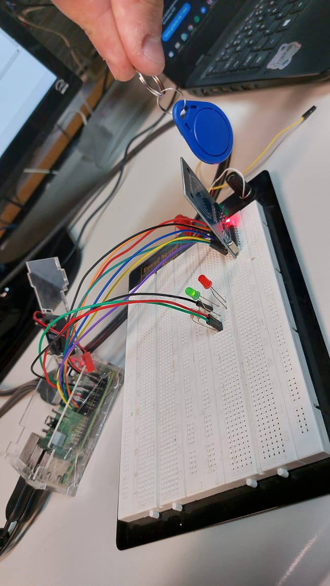

# SEL0337

Este repositório é dedicado ao desenvolvimento de atividades para a disciplina "Projetos em Sistemas Embarcados" (SEL0337), oferecida no segundo semestre de 2023 na Universidade de São Paulo.

## Autores
- Giovana Rodrigues do Nascimento - Nº USP: 12547980
- Johnny Caselato Guimarães - Nº USP: 11915481

### Projetos em Sistemas Embarcados - Atividade Prática 6
Introdução às interfaces de visão computacional, sistemas de versionamento de arquivos e controle de acesso via Tags

#### Parte 1: Registro e Leitura de TAG RFID
Na primeira parte da atividade utilizamos o módulo SimpleMFRC522 para ler dados de uma etiqueta RFID em um leitor. Nisso dois LEDs serão controlados, usando a biblioteca RPi.GPIO, como indicadores visuais. O código configura os pinos, inicializa os LEDs e inicia um loop infinito para ler continuamente a etiqueta RFID. Se a ID lida corresponder à ID predefinida (ID_tag), o LED1 é aceso, indicando "Acesso Liberado". Caso contrário, o LED2 é aceso, indicando "Acesso Negado". O programa exibe a ID e o texto lidos da etiqueta RFID e aguarda a próxima leitura.

#### Parte 2: Reconhecimento de faces com câmera
Nesta parte da atividade foi modificado um exemplo de código, o qual captura imagens de uma câmera Raspberry Pi usando a biblioteca picamera2 e realiza detecção de rosto em tempo real usando a biblioteca OpenCV. Ele inicializa os pinos GPIO para controlar um LED e grava continuamente várias imagens, convertendo-as primeiro para a escala de cinza, e então aplica um algoritmo de detecção de rosto. Se um ou mais rostos são detectados, um LED é aceso; caso contrário, o LED é mantido apagado.
